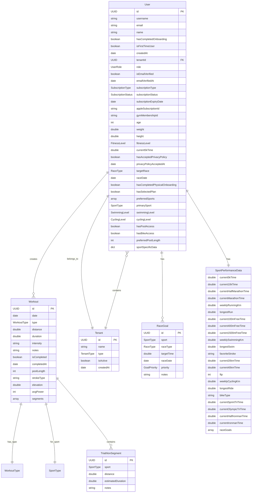

# RunAI - Modelo de Datos y Persistencia

## Visión General

RunAI utiliza **persistencia local** basada en `UserDefaults` para almacenar todos los datos de la aplicación. Esto proporciona una experiencia offline-first y simplifica la arquitectura inicial, aunque está diseñada para migrar a una base de datos remota en el futuro.

## Diagrama de Entidades



## Modelos de Datos Detallados

### 1. User Model

```swift
struct User: Codable, Equatable {
    // Identificación básica
    let id: UUID
    let username: String
    let email: String
    let name: String
    
    // Estado de la aplicación
    let hasCompletedOnboarding: Bool
    let isFirstTimeUser: Bool
    let createdAt: Date
    
    // Multi-tenant
    var tenantId: UUID?
    var role: UserRole
    var isEmailVerified: Bool
    var emailVerifiedAt: Date?
    
    // Suscripciones
    var subscriptionType: SubscriptionType
    var subscriptionStatus: SubscriptionStatus
    var subscriptionExpiryDate: Date?
    var appleSubscriptionId: String?
    var gymMembershipId: String?
    
    // Datos físicos
    var age: Int?
    var weight: Double? // kg
    var height: Double? // cm
    
    // Fitness
    var fitnessLevel: FitnessLevel?
    var current5kTime: TimeInterval? // seconds
    
    // Objetivos
    var targetRace: RaceType?
    var raceDate: Date?
    
    // Multi-deporte
    var preferredSports: [SportType]
    var primarySport: SportType
    var swimmingLevel: SwimmingLevel?
    var cyclingLevel: CyclingLevel?
    var hasPoolAccess: Bool
    var hasBikeAccess: Bool
    var preferredPoolLength: Int?
    
    // Datos específicos por deporte (JSON)
    var sportSpecificData: [String: SportPerformanceData]
}
```

### 2. Workout Model

```swift
struct Workout: Codable, Equatable, Identifiable {
    let id: UUID
    let date: Date
    let type: WorkoutType
    
    // Métricas generales
    var distance: Double? // km o metros según deporte
    var duration: TimeInterval? // seconds
    var intensity: String? // Easy, Moderate, Hard, etc.
    var notes: String
    var isCompleted: Bool
    var completedAt: Date?
    
    // Natación específico
    var poolLength: Int? // metros (25m, 50m)
    var strokeType: String? // Libre, Espalda, Braza, Mariposa
    
    // Ciclismo específico
    var elevation: Double? // metros de desnivel
    var avgPower: Int? // watts promedio
    
    // Triatlón específico
    var segments: [TriathlonSegment]?
}
```

### 3. Tenant Model

```swift
struct Tenant: Codable, Equatable {
    let id: UUID
    let name: String
    let type: TenantType // individual, gym
    var isActive: Bool
    let createdAt: Date
}

struct GymTenant: Codable, Equatable {
    let tenant: Tenant
    var gymName: String
    var address: String?
    var contactEmail: String?
    var maxMembers: Int
    var currentMemberCount: Int
    var subscriptionTier: GymSubscriptionTier
    var features: [GymFeature]
}
```

## Enumeraciones Principales

### SportType
```swift
enum SportType: String, CaseIterable, Codable {
    case running = "running"
    case swimming = "swimming" 
    case cycling = "cycling"
    case triathlon = "triathlon"
}
```

### WorkoutType
```swift
enum WorkoutType: String, CaseIterable, Codable {
    // Running
    case easyRun = "easy_run"
    case longRun = "long_run"
    case intervals = "intervals"
    case tempoRun = "tempo_run"
    case recovery = "recovery"
    
    // Swimming
    case enduranceSwim = "endurance_swim"
    case swimIntervals = "swim_intervals"
    case techniqueSwim = "technique_swim"
    
    // Cycling
    case enduranceCycle = "endurance_cycle"
    case cyclingIntervals = "cycling_intervals"
    case hillRepeats = "hill_repeats"
    
    // Triathlon
    case brickWorkout = "brick_workout"
    case transitionPractice = "transition_practice"
}
```

### Subscription Types
```swift
enum SubscriptionType: String, CaseIterable, Codable {
    case free = "free"
    case premium = "premium"
    case gymMember = "gym_member"
    case gymAdmin = "gym_admin"
}

enum SubscriptionStatus: String, CaseIterable, Codable {
    case active = "active"
    case expired = "expired"
    case cancelled = "cancelled"
    case pending = "pending"
}
```

## Persistencia Local

### UserDefaults Keys
```swift
enum StorageKeys {
    static let currentUser = "currentUser"
    static let workouts = "workouts"
    static let currentTenant = "currentTenant"
    static let subscriptionData = "subscriptionData"
    static let onboardingState = "onboardingState"
    static let userPendingVerification = "userPendingVerification"
}
```

### Estructura de Almacenamiento
```json
{
  "currentUser": {
    "id": "uuid",
    "username": "string",
    "email": "string",
    "sportSpecificData": {
      "running": {
        "current5kTime": 1200,
        "weeklyRunningKm": 25,
        "raceGoals": [...]
      },
      "swimming": {
        "current100mFreeTime": 90,
        "favoriteStroke": "Libre"
      }
    }
  },
  "workouts": [
    {
      "id": "uuid",
      "date": "2025-09-15",
      "type": "easy_run",
      "distance": 5.0,
      "duration": 1800,
      "notes": "Carrera suave matutina"
    }
  ]
}
```

## Relaciones de Datos

### 1. Usuario → Entrenamientos (1:N)
- Un usuario puede tener múltiples entrenamientos
- Cada entrenamiento pertenece a un único usuario
- Filtrado por fecha y tipo de deporte

### 2. Usuario → Tenant (N:1)
- Un usuario pertenece a un tenant
- Un tenant puede tener múltiples usuarios (gimnasios)
- Determina permisos y funcionalidades disponibles

### 3. Usuario → SportPerformanceData (1:1)
- Cada usuario tiene datos de rendimiento por deporte
- Almacenado como JSON flexible para extensibilidad
- Incluye objetivos de carrera por disciplina

### 4. Entrenamiento → TriathlonSegment (1:N)
- Solo para entrenamientos de triatlón
- Cada segmento representa una disciplina (natación, ciclismo, running)
- Permite tracking granular de entrenamientos brick

## Migración Futura

### Preparación para Base de Datos Remota
La estructura actual está diseñada para facilitar la migración a una base de datos remota:

1. **Modelos Codable**: Listos para serialización JSON
2. **UUIDs**: Identificadores únicos preparados para sincronización
3. **Timestamps**: Campos de auditoría para conflictos de sincronización
4. **Estructura Normalizada**: Relaciones bien definidas

### Consideraciones de Sincronización
```swift
// Campos adicionales para sincronización futura
struct SyncableEntity {
    var lastModified: Date
    var syncStatus: SyncStatus // pending, synced, conflict
    var version: Int
    var deviceId: String
}
```

## Optimizaciones de Rendimiento

### 1. Lazy Loading
- Entrenamientos cargados por rangos de fecha
- Datos de rendimiento cargados bajo demanda
- Cache inteligente de consultas frecuentes

### 2. Batch Operations
- Múltiples entrenamientos guardados en una operación
- Bulk updates para cambios masivos
- Transacciones atómicas simuladas

### 3. Indexing Strategy
```swift
// Índices lógicos para búsquedas eficientes
extension DataManager {
    func getWorkouts(for sport: SportType, in dateRange: DateRange) -> [Workout]
    func getWorkouts(by type: WorkoutType, limit: Int) -> [Workout]
    func getUsersByTenant(_ tenantId: UUID) -> [User]
}
```

## Backup y Recuperación

### Export de Datos
```swift
struct DataExport: Codable {
    let exportDate: Date
    let version: String
    let user: User
    let workouts: [Workout]
    let settings: AppSettings
}
```

### Import de Datos
- Validación de integridad
- Merge inteligente de datos existentes
- Preservación de IDs únicos

---

*Documentación actualizada: Septiembre 2025*
