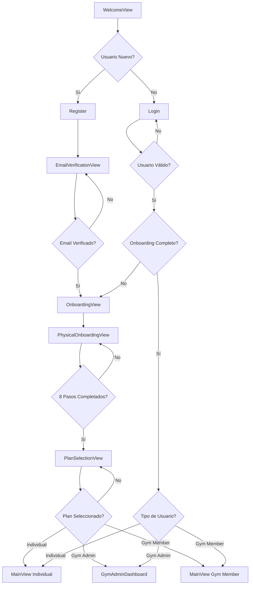

# RunAI - Flujos de Usuario

## Visión General

Este documento describe los flujos de usuario principales en RunAI, desde el primer contacto hasta el uso avanzado de todas las funcionalidades. Los flujos están diseñados para ser intuitivos y guiar al usuario paso a paso.

## Mapa de Flujos Principales



## 1. 🚀 Flujo de Primera Experiencia

### **Objetivo**: Llevar a un usuario nuevo desde el descubrimiento hasta el primer uso

#### Paso 1: Landing y Registro
```
WelcomeView
├── Ver badges de distancia animados
├── Leer propuesta de valor
├── Decidir: "Crear Cuenta" o "Iniciar Sesión"
└── Tap "Crear Cuenta" → RegisterView (modal)
```

**Criterios de Éxito**:
- Usuario entiende el valor de RunAI
- Completa registro sin fricción
- Email válido proporcionado

#### Paso 2: Verificación de Email
```
EmailVerificationView
├── Email enviado automáticamente
├── Usuario ingresa código de 6 dígitos
├── Validación en tiempo real
├── Opción de reenvío (cooldown 60s)
└── Verificación exitosa → OnboardingView
```

**Criterios de Éxito**:
- Email verificado en < 2 minutos
- Usuario no abandona por problemas técnicos
- Código recibido y validado correctamente

#### Paso 3: Onboarding Educativo
```
OnboardingView
├── Página 1: "Bienvenido a RunAI"
├── Página 2: "Planes Personalizados con IA"
├── Página 3: "Multi-deporte: Running, Natación, Ciclismo"
├── Página 4: "Seguimiento y Análisis"
└── Botón "Comenzar" → PhysicalOnboardingView
```

**Criterios de Éxito**:
- Usuario comprende las funcionalidades principales
- Completa el carrusel o salta al final
- Motivación alta para continuar

#### Paso 4: Configuración Física Detallada
```
PhysicalOnboardingView (8 pasos)
├── Paso 1: Datos Básicos
│   ├── Edad (slider 15-80)
│   ├── Peso (input kg)
│   └── Altura (input cm)
├── Paso 2: Selección de Deportes
│   ├── Grid visual de deportes
│   ├── Multi-selección
│   └── Mínimo 1 deporte requerido
├── Paso 3: Deporte Principal
│   ├── Selector horizontal
│   └── Solo deportes previamente seleccionados
├── Paso 4: Configuración Específica
│   ├── Si natación: Acceso a piscina, longitud preferida
│   ├── Si ciclismo: Acceso a bicicleta, tipo
│   └── Configuraciones condicionales
├── Paso 5: Datos de Rendimiento (por deporte)
│   ├── Running: Tiempo 5K, km semanales, carrera más larga
│   ├── Natación: Tiempo 100m libre, km semanales, brazada favorita
│   ├── Ciclismo: Tiempo 20km, FTP, km semanales, tipo de bici
│   └── Triatlón: Tiempos de triatlón previos
├── Paso 6: Nivel de Fitness
│   ├── Principiante → Experto
│   └── Descripción de cada nivel
├── Paso 7: Objetivos de Carrera
│   ├── Por cada deporte seleccionado
│   ├── Tipo de carrera, fecha objetivo, prioridad
│   └── Secciones colapsables
└── Paso 8: Términos y Privacidad
    ├── Aceptación de términos
    ├── Política de privacidad
    └── Finalización → PlanSelectionView
```

**Criterios de Éxito**:
- Datos completos y precisos recolectados
- Usuario no abandona por longitud del proceso
- Información suficiente para personalización

#### Paso 5: Selección de Plan
```
PlanSelectionView
├── Opción 1: Individual
│   ├── Free Plan (limitaciones claras)
│   └── Premium Plan (beneficios destacados)
├── Opción 2: Unirse a Gimnasio
│   ├── Código de invitación
│   └── Búsqueda de gimnasio
├── Opción 3: Crear Gimnasio (Enterprise)
│   ├── Información del gimnasio
│   ├── Plan de facturación
│   └── Configuración inicial
└── Selección → MainView o GymAdminDashboard
```

**Criterios de Éxito**:
- Plan seleccionado apropiado para el usuario
- Pago procesado exitosamente (si aplica)
- Acceso completo a funcionalidades

### **Tiempo Total Estimado**: 8-12 minutos
### **Tasa de Conversión Objetivo**: >70% completar onboarding

---

## 2. 🔄 Flujo de Usuario Recurrente

### **Objetivo**: Experiencia diaria optimizada para usuarios establecidos

#### Login Rápido
```
WelcomeView → LoginView
├── Username/Email (autocompletado)
├── Validación instantánea
└── Login exitoso → MainView
```

#### Dashboard Diario
```
MainView
├── Header: Saludo personalizado, acceso a perfil
├── Selector: Día/Semana
├── Fecha: Navegación temporal
├── Filtro: Por deporte (si multi-deporte)
├── Contenido: DailyView/WeeklyView
└── FABs: Acciones rápidas
```

#### Interacciones Comunes
- **Ver entrenamientos del día**: Scroll vertical en DailyView
- **Marcar como completado**: Tap en checkbox de workout
- **Navegar fechas**: Swipe o tap en flechas
- **Cambiar vista**: Toggle Día/Semana
- **Filtrar por deporte**: Tap en chips de deporte

---

## 3. ➕ Flujo de Creación de Entrenamiento

### **Objetivo**: Añadir entrenamientos manuales rápida y fácilmente

```
MainView → Tap FAB "+" → AddWorkoutView
├── Selección de Deporte
│   ├── Running, Natación, Ciclismo, Triatlón
│   └── Actualiza tipos disponibles
├── Tipo de Entrenamiento
│   ├── Lista filtrada por deporte
│   └── Iconos descriptivos
├── Métricas Generales
│   ├── Distancia (unidades dinámicas)
│   ├── Duración (HH:MM)
│   └── Intensidad (selector)
├── Métricas Específicas (condicionales)
│   ├── Natación: Piscina, brazada
│   ├── Ciclismo: Elevación, potencia
│   └── Triatlón: Segmentos múltiples
├── Fecha y Notas
│   ├── Date picker
│   └── Campo de texto libre
└── Guardar → Vuelta a MainView
```

**Validaciones**:
- Distancia > 0
- Duración opcional pero recomendada
- Fecha no futura (warning)
- Campos específicos según deporte

**Tiempo Estimado**: 1-2 minutos

---

## 4. 🤖 Flujo de Generación de Plan con IA

### **Objetivo**: Crear planes personalizados usando inteligencia artificial

```
MainView → Tap FAB "🧠" → TrainingPlanGeneratorView
├── Paso 1: Selección de Disciplina
│   ├── Running, Natación, Ciclismo, Triatlón
│   └── Información del usuario cargada
├── Paso 2: Tipo de Carrera
│   ├── Lista filtrada por disciplina
│   ├── 5K, 10K, Media, Maratón (running)
│   ├── Sprint, Olímpico, Ironman (triatlón)
│   └── Distancias personalizadas
├── Paso 3: Configuración de Objetivo
│   ├── Fecha de la carrera
│   ├── Tiempo objetivo (opcional)
│   └── Nivel de prioridad
├── Paso 4: Preguntas Contextuales
│   ├── Experiencia previa en la distancia
│   ├── Disponibilidad de entrenamiento
│   ├── Preferencias de intensidad
│   └── Limitaciones/lesiones
├── Paso 5: Generación
│   ├── Loading con agente especializado
│   ├── Prompt personalizado enviado
│   └── Plan generado por IA
├── Paso 6: Preview del Plan
│   ├── Resumen: duración, entrenamientos/semana
│   ├── Desglose por semanas
│   ├── Tipos de entrenamiento incluidos
│   └── Métricas esperadas
└── Confirmar → Plan añadido a MainView
```

**Agentes Especializados**:
- **RunningAgent**: Planes de running con periodización
- **SwimmingAgent**: Técnica + resistencia + velocidad
- **CyclingAgent**: Potencia + resistencia + intervalos
- **TriathlonOrchestrator**: Coordina los 3 deportes

**Criterios de Éxito**:
- Plan generado en < 30 segundos
- Entrenamientos realistas y progresivos
- Usuario satisfecho con la personalización

**Tiempo Estimado**: 3-5 minutos

---

## 5. 💬 Flujo de Chat con IA

### **Objetivo**: Consultas directas y consejos personalizados

```
MainView → Tap FAB "💬" → ChatView
├── Contexto Automático
│   ├── Datos del usuario cargados
│   ├── Entrenamientos recientes
│   └── Plan actual (si existe)
├── Interfaz de Chat
│   ├── Historial de conversaciones
│   ├── Input de mensaje
│   └── Envío con Enter o botón
├── Respuestas Inteligentes
│   ├── Consejos de entrenamiento
│   ├── Análisis de progreso
│   ├── Recomendaciones nutricionales
│   └── Motivación personalizada
└── Historial Persistente
```

**Tipos de Consultas Comunes**:
- "¿Cómo mejorar mi tiempo en 5K?"
- "Tengo dolor en la rodilla, ¿qué hago?"
- "¿Está bien mi progreso semanal?"
- "Consejos para mi primera media maratón"

**Tiempo de Respuesta**: < 5 segundos

---

## 6. 👤 Flujo de Gestión de Perfil

### **Objetivo**: Actualizar datos personales y configuración

```
MainView → Tap Avatar → ProfileView
├── Información Personal
│   ├── Editar nombre, email
│   ├── Actualizar foto de perfil
│   └── Cambiar contraseña
├── Datos Físicos
│   ├── Peso, altura actualizables
│   ├── Historial de cambios
│   └── Gráficos de progreso
├── Datos de Rendimiento
│   ├── Por cada deporte practicado
│   ├── Métricas actualizables
│   └── Comparación temporal
├── Objetivos
│   ├── Carreras objetivo actuales
│   ├── Añadir/editar/eliminar
│   └── Seguimiento de progreso
├── Configuración
│   ├── Notificaciones
│   ├── Tema de la app
│   ├── Unidades de medida
│   └── Privacidad
└── Gestión de Cuenta
    ├── Suscripción actual
    ├── Historial de pagos
    ├── Exportar datos
    └── Eliminar cuenta
```

**Actualizaciones Críticas**:
- Cambios de peso → Recalcular planes
- Nuevos objetivos → Sugerir planes
- Lesiones → Modificar entrenamientos

---

## 7. 🏢 Flujo de Administración de Gimnasio

### **Objetivo**: Gestión completa de gimnasio y miembros

#### Configuración Inicial
```
PlanSelectionView → "Crear Gimnasio" → GymConfigurationView
├── Información Básica
│   ├── Nombre del gimnasio
│   ├── Dirección y contacto
│   └── Descripción
├── Configuración de Membresía
│   ├── Límite de miembros
│   ├── Tipos de membresía
│   └── Características incluidas
├── Integraciones
│   ├── Sistema de pago
│   ├── Software de membresía existente
│   └── APIs externas
└── Finalizar → GymAdminDashboard
```

#### Gestión Diaria
```
GymAdminDashboard
├── Estadísticas
│   ├── Miembros activos
│   ├── Entrenamientos realizados
│   ├── Engagement semanal
│   └── Métricas de uso
├── Gestión de Miembros
│   ├── Lista de usuarios
│   ├── Estados de membresía
│   ├── Invitaciones pendientes
│   └── Reportes individuales
├── Configuración
│   ├── Ajustes del gimnasio
│   ├── Roles y permisos
│   ├── Branding personalizado
│   └── Integraciones
└── Reportes
    ├── Analytics detallados
    ├── Exportar datos
    └── Facturación
```

#### Invitación de Miembros
```
GymAdminDashboard → "Invitar Miembro" → InviteUserView
├── Email del nuevo miembro
├── Tipo de membresía
├── Mensaje personalizado (opcional)
├── Envío de invitación
└── Seguimiento de estado
```

---

## 8. 💳 Flujo de Suscripciones

### **Objetivo**: Gestión transparente de pagos y planes

#### Upgrade a Premium
```
Función Premium Bloqueada → PaywallView
├── Comparación Free vs Premium
├── Lista de beneficios premium
├── Testimonios y casos de éxito
├── Precios y opciones de pago
├── Apple In-App Purchase
└── Activación inmediata
```

#### Gestión de Suscripción
```
ProfileView → "Suscripción" → SubscriptionView
├── Estado Actual
│   ├── Plan activo
│   ├── Fecha de renovación
│   └── Método de pago
├── Historial
│   ├── Transacciones previas
│   ├── Cambios de plan
│   └── Facturas descargables
├── Opciones
│   ├── Cambiar plan
│   ├── Cancelar suscripción
│   ├── Restaurar compras
│   └── Contactar soporte
└── Confirmaciones de cambios
```

---

## 9. 🔄 Flujos de Error y Recuperación

### Errores de Red
```
Acción Fallida
├── Mostrar error específico
├── Botón "Reintentar"
├── Opción "Trabajar sin conexión"
└── Sincronización automática al reconectar
```

### Errores de IA
```
Generación de Plan Fallida
├── Mensaje de error claro
├── Sugerencia de solución
├── Opción de plan manual
└── Reporte de problema (opcional)
```

### Pérdida de Datos
```
Datos No Guardados
├── Detección automática
├── Dialog de confirmación
├── Opción de guardar borrador
└── Recuperación automática
```

---

## 10. 📊 Métricas de Flujo

### KPIs Principales
- **Tasa de Completado de Onboarding**: >70%
- **Tiempo de Primera Generación de Plan**: <5 min desde registro
- **Retención Día 7**: >50%
- **Conversión Free→Premium**: >15%
- **Tiempo Promedio en App**: >8 min/sesión

### Puntos de Abandono Críticos
1. **Verificación de Email**: 20% abandono
2. **Paso 5 de Onboarding Físico**: 15% abandono
3. **Selección de Plan**: 10% abandono
4. **Primera Generación de Plan IA**: 8% abandono

### Optimizaciones Implementadas
- **Progress Indicators**: En todos los flujos multi-paso
- **Auto-save**: En formularios largos
- **Skip Options**: En contenido opcional
- **Quick Actions**: FABs para acciones frecuentes
- **Smart Defaults**: Valores pre-rellenados cuando posible

---

*Documentación actualizada: Septiembre 2025*
